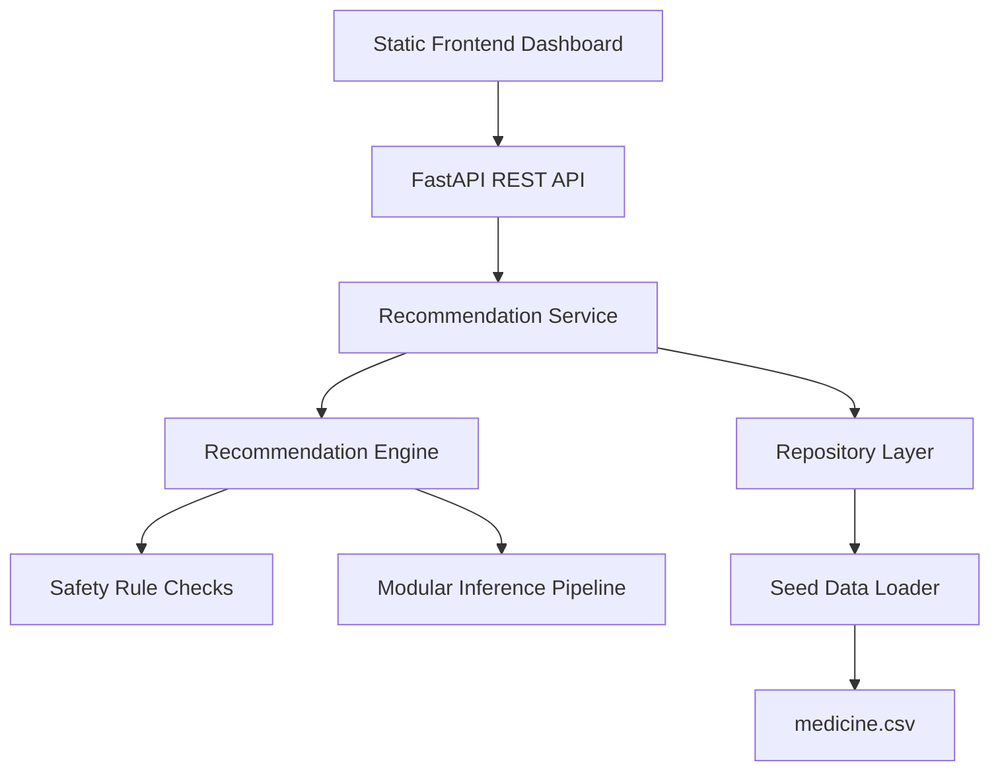

# Architecture

## Overview

This repository has been refactored from a single-file Streamlit demo into a modular platform foundation for educational clinical decision support.

## Layers

- `backend/app/api`: REST routes
- `backend/app/services`: application services
- `backend/app/engine`: recommendation and safety logic
- `backend/app/inference`: pluggable ML inference contracts
- `backend/app/repositories`: data access abstraction
- `backend/app/data`: import/seed utilities
- `frontend`: responsive browser UI

## Production direction

The current implementation uses an in-memory repository and heuristic engine so the project is runnable immediately. To scale toward production, swap in:

- PostgreSQL + SQLAlchemy repositories
- vector database / embedding service for semantic search
- calibrated ensemble models in `backend/app/inference`
- external knowledge ingestion pipelines for RxNorm, OpenFDA, SIDER, MedlinePlus, SNOMED CT, ICD-10, WHO essential medicines, and licensed data sources
- async task queue for ingestion and background validation
